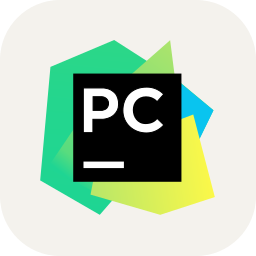

Hi  , I'm Anurag Verma
=================================================================================================================================

Fullstack WebDev / (AI/ML) developer
------------------------------------

* 🌍  I'm based in Uttar Pradesh,India
* ✉️  You can contact me at [Email](mailto:anurag5055@gmail.com)
* 🚀  I'm currently working on machine learning

## My Experience in Following Technologies:

### 🌐 Web Development
| Technology          | Icon                               |
|---------------------|------------------------------------|
| **HTML**            |  |
| **CSS**             |  |
| **Bootstrap**       |  |
| **jQuery**          |  |
| **JavaScript**      |  |
| **PHP**             |  |
| **Django**          |  |
| **Node.js**         |  |
| **Express.js**      |  |
| **React.js**        |  |

### 🛠️ Programming and Scripting
| Technology          | Icon                               |
|---------------------|------------------------------------|
| **C**               |  |
| **C++**             |  |

### 📊 Data Science and AI/ML
| Technology          | Icon                               |
|---------------------|------------------------------------|
| **Python**          |  |
| **NumPy**           |  |
| **Pandas**          |  |
| **PyTorch**         |  |
| **OpenCV**          |  |

### 📦 DevOps and Cloud
| Technology          | Icon                               |
|---------------------|------------------------------------|
| **Docker**          |  |
| **Git**             |  |
| **GitHub**          |  |

### 🖥️ Embedded Systems
| Technology          | Icon                               |
|---------------------|------------------------------------|
| **Arduino**         |  |

### 🖥️ Operating Systems
| Technology          | Icon                               |
|---------------------|------------------------------------|
| **Linux**           |  |
| **Ubuntu**          |  |
| **Window**          |  |
| **Android**          |  |
